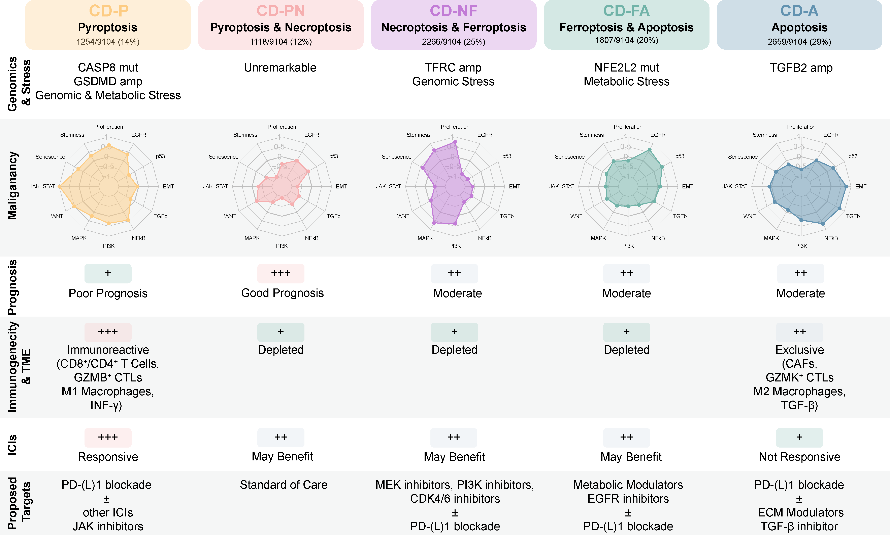

# <h1 align="center">PanDeath</h1>

<h4 align="center">A streamlined framework for classifying cancer samples into programmed cell death (PCD) subtypes</h4>

## Table of Contents

* [Introduction](#introduction)
* [Quickstart Guide](#quickstart-guide)
  * [Setup](#setup)
  * [Required Input Format](#required-input-format)
* [Workflow for predicting PCD Subtypes](#workflow-for-predicting-pcd-subtypes)
  * [Step 1: Infer PCD Subtypes](#step-1-infer-pcd-subtypes)
  * [Step 2: Compute ssGSEA Scores for the Four PCD Modes](#step-2-compute-ssgsea-scores-for-the-four-pcd-modes)
  * [Step 3 (Optional): Evaluate Concordance with NMF-derived Subtypes](#step-3-optional-evaluate-concordance-with-nmf-derived-subtypes)
* [Publication](#publication)
* [Maintainers](#maintainers)

## Introduction

This repository provides an easy-to-run implementation of the pan-cancer programmed cell death (PCD) subtyping framework developed in our study.

Briefly, using integrative multi-cohort pan-cancer transcriptomic analysis with **non-negative matrix factorization (NMF)** encompassing four canonical PCD modalities—**pyroptosis, necroptosis, ferroptosis, and apoptosis**—we identified **five conserved PCD subtypes** :

* **CD-P** — Pyroptosis dominant
* **CD-PN** — Pyroptosis & Necroptosis dominant 
* **CD-NF** — Necroptosis & Ferroptosis dominant
* **CD-FA** — Ferroptosis & Apoptosis dominant
* **CD-A** — Apoptosis dominant

These subtypes exhibit distinct genomic alterations, cellular stresses, malignant features, and immune microenvironment landscapes. Notably, they are associated with distict prognoses and immunotherapy responses, underscoring their translational potential for precision oncology.

  

To enable seamless application of this framework to new datasets, we developed a supervised classifier that robustly assigns samples to the five PCD subtypes. The present pipeline provides an implementation of this classifier.

## Quickstart Guide

### Setup

* A **Jupyter Notebook** environment is required to run the provided `.ipynb` scripts.
* All required dependencies are listed in each script.
* **Python ≥ 3.0** and **R ≥ 4.0** are required.

### Required Input Format

Make sure the RNA-seq expression matrix meets the following requirements:
1. **Tab-separated file** (`.tsv`)
2. **Samples** as rows and **genes (HUGO symbols)** as columns
3. **TPM-quantified** and **log2-normalized** 
4. **Robust-scaled** (if your data includes multiple cancers, please apply robust scaling within each cancer type)

> Example PCD expression matrices for the TCGA cohort, CPTAC cohort, and the pan-ICI cohort (as used in our paper) are provided in the `Data/` folder. 

> The notebook `1-Infer_PCD_subtype.ipynb` includes helper code for preprocessing if needed.

## Workflow for predicting PCD Subtypes

### **Step 1: Infer PCD Subtypes**

Run `1-Infer_PCD_subtype.ipynb`

**Outputs**

* `Prediction.tsv` — Predicted subtype for each sample + subtype probabilities.
* `Prediction_probability.png` — Bar plots of subtype probability for each sample.

### **Step 2: Compute ssGSEA Scores for the Four PCD Modes**

Run `2-PCD_score.R`

**Outputs**

* `PCD_Score.tsv` — ssGSEA scores for pyroptosis, necroptosis, ferroptosis, and apoptosis for each sample.
* `CD-X_Score.png` — Boxplots showing PCD mode scores across subtypes.

### **Step 3 (Optional): Evaluate Concordance with NMF-derived Subtypes**
> Useful for internal benchmarking or when ground-truth labels are available.

Run `3-Concordance.ipynb`

**Outputs**

* `Performance_overall.tsv` — Overall accuracy, AUC, precision, recall, and F1 score
* `Performance_subtype.tsv` — Performance metrics for each subtype
* `Confusion_matrix.png` — Confusion matrix
* `ROC.png` — Receiver Operating Curves for each subtype

## Publication

*Coming soon — manuscript currently under submission.*

> *⚠️ Example data and the predictive model will be released upon publication.*

## Maintainers

* **Zweig Wong** (GitHub: `Zweig-Wong`)
